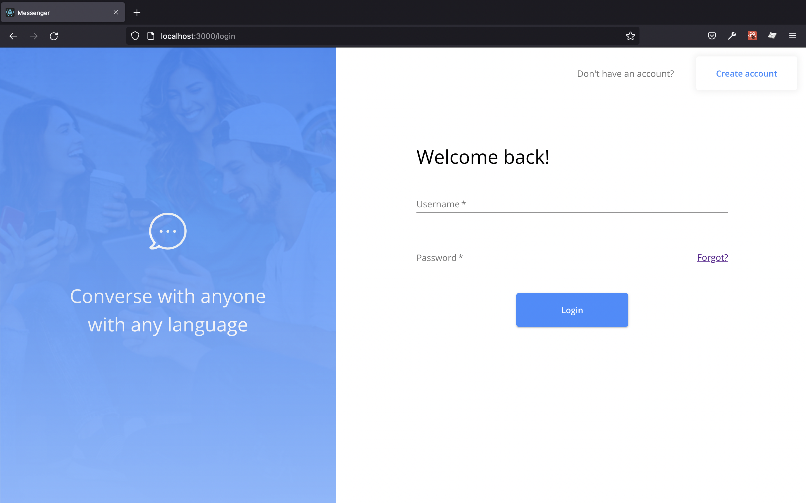

# TASK 1

---

### Description and Question :-

I have used browser debugger tool identify the main problem which is component not rendering. I found three issues :

### Answer :-

1. To render the component when user send a message, create new variable (copy of old) and make changes in that variable before setting the state value.
2. Use async await on "postMessage" function because "saveMessage" returns a promis.
3. To display correct order of message sort the messages by ids.

# TASK 2

---

### Description and Question :-

We want to track for each message if it has been read by the recipient, and to make several front end UI updates with this information, such as displaying how many unread messages there are in a given conversation.

You can reference the spec in this Figma file for the various updates to be made to reflect unread messages. (Note that the Figma file includes more than just the spec needed for this feature). Please include a screenshot in your description showing your updated UI.

In your description, please explain a couple different ways we could have stored the read status in the database for this feature. What are the benefits and drawbacks of each?

### Answer :-

##### Updated Login UI

##### Updated Register UI

##### Display Unread Message

##### Added Emoji and File Upload on Input field

##### Show Typing Indicator

